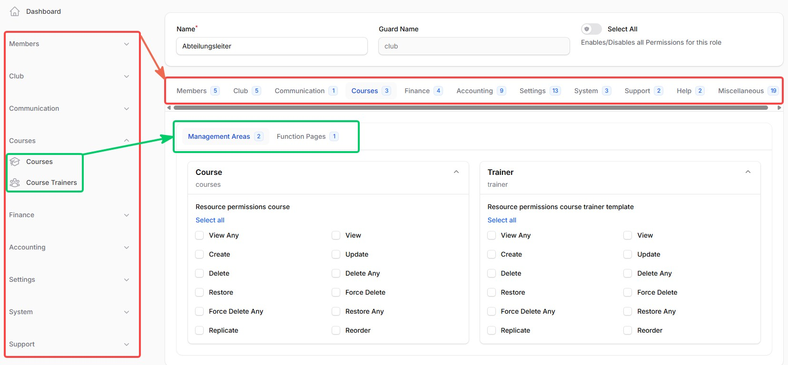
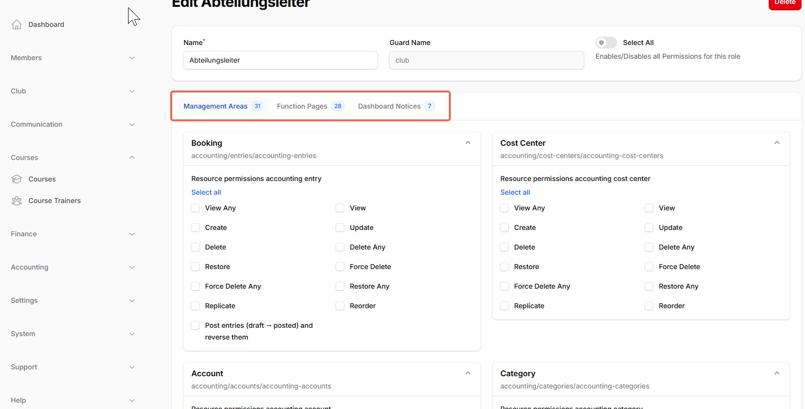

# Filament Shield Enhanced

[](https://plumbphp.dev/agroezinger/filament-shield-enhanced) [](https://plumbphp.dev/agroezinger/filament-shield-enhanced) [](https://plumbphp.dev/agroezinger/filament-shield-enhanced) [](https://plumbphp.dev/agroezinger/filament-shield-enhanced) [](https://plumbphp.dev/agroezinger/filament-shield-enhanced)

> [!WARNING]
> **Testing Phase:** Versions `0.*.*` are currently in the testing phase. At present, there are no known bugs.

A standalone addon for [bezhansalleh/filament-shield](https://github.com/bezhanSalleh/filament-shield) that adds **fine-grained page, resource and component permissions** and a **structured Role Resource UI** — without forking or replacing the original package.

> **Why this exists.**  
> The features were proposed upstream in [bezhanSalleh/filament-shield#698](https://github.com/bezhanSalleh/filament-shield/issues/698). The author has not had time to review the PR. This addon ships the same functionality as a composable layer on top of the official package.

---

## Table of Contents

- [Screenshots](#screenshots)
- [Features](#features)
- [Requirements](#requirements)
- [Installation](#installation)
- [Usage — Pages](#usage--pages)
  - [1 — Declare fine-grained permissions on a Page](#1--declare-fine-grained-permissions-on-a-page)
  - [2 — Check permissions in PHP (Pages)](#2--check-permissions-in-php-pages)
  - [3 — Inject permissions into child Livewire components](#3--inject-permissions-into-child-livewire-components)
- [Usage — Resources](#usage--resources)
  - [4 — Declare fine-grained permissions on a Resource](#4--declare-fine-grained-permissions-on-a-resource)
  - [5 — Check resource permissions in PHP](#5--check-resource-permissions-in-php)
  - [Attaching a deviation hint to any permission checkbox](#attaching-a-deviation-hint-to-any-permission-checkbox)
- [Usage — Components](#usage--components)
  - [6 — Declare fine-grained permissions on a component](#6--declare-fine-grained-permissions-on-a-component)
  - [7 — Check permissions in PHP (Components)](#7--check-permissions-in-php-components)
  - [8 — Structured UI in the published RoleResource](#8--structured-ui-in-the-published-roleresource)
    - [8a — RoleResource: replace the standard Resources/Pages tabs](#8a--roleresource-replace-the-standard-resourcespages-tabs)
    - [8b — EditRole: add the pre-fill trait](#8b--editrole-add-the-pre-fill-trait)
    - [8c — Optional: group everything by navigation, in one unified tab bar](#8c--optional-group-everything-by-navigation-in-one-unified-tab-bar)
- [Configuration](#configuration)
- [Localization](#localization)
- [How it works internally](#how-it-works-internally)
- [Changelog](#changelog)
- [License](#license)
- [Credits](#credits)

---

## Screenshots

A RoleResource built with the grouped recipe from [§8c](#8c--optional-group-everything-by-navigation-in-one-unified-tab-bar), with `ui.group_by_navigation` (see [Configuration](#configuration)) toggled both ways:

**`group_by_navigation: true`** — top level clusters by navigation group, matching the sidebar exactly (red); a second tab row underneath separates Resources from Pages within each group (green):



**`group_by_navigation: false`** — no navigation-group tabs at all; the Resources/Pages/Widgets sub-tabs sit directly at the top level instead, each showing every entry of that type across the whole panel in one flat list (red):



---

## Features

| Feature                               | Description                                                                                                                                     |
| ------------------------------------- | ----------------------------------------------------------------------------------------------------------------------------------------------- |
| **Multi-action page permissions**     | Declare several permissions per page via `getShieldPagePermissions()`.                                                                          |
| **Multi-action resource permissions** | Declare custom permissions per resource via `getShieldResourcePermissions()` — beyond the standard CRUD policy methods.                         |
| **Multi-action component permissions**| Declare permissions on any Livewire component (not registered with a panel) via `getShieldComponentPermissions()`.                              |
| **`canShield('action')`**             | Fluent, type-safe permission check — instance method on Pages and Components, static method on Resources.                                       |
| **`getShieldPermissions()`**          | Returns a pre-resolved `action → bool` map for injection into child Livewire components.                                                        |
| **`HasInjectedShieldPermissions`**    | Trait for child Livewire components that receive the map from a parent page or component.                                                       |
| **`EnhancedPagePermissionsForm`**     | Form builder helper for the published RoleResource — one Section per Page, combining filament-shield's own standard permission with any fine-grained actions from `getShieldPagePermissions()` in the same checkbox list.               |
| **`EnhancedResourcePermissionsForm`** | Form builder helper for the published RoleResource — one Section per Resource, combining the standard CRUD permissions with any fine-grained actions from `getShieldResourcePermissions()` in the same checkbox list.           |
| **`EnhancedComponentPermissionsForm`**| Form builder helper for the published RoleResource — renders each enhanced component as a separate Section with individual checkboxes.          |
| **`getShieldPermissionDescriptions()`** | Optional hook on Resources/Pages (with or without fine-grained actions) to attach a help text under *any* individual permission checkbox — standard CRUD included. Use it where the checkbox's real-world effect deviates from what its label implies. |
| **`NavigationGroupResolver`**         | Resolves a Resource's/Page's navigation group to a display string, and the panel's own `->navigationGroups()` order — the building block behind grouping the RoleResource UI the same way the sidebar is grouped. |
| **`discoverResources()` / `discoverPages()`** | Public on `EnhancedResourcePermissionsForm` / `EnhancedPagePermissionsForm` — return every Resource/Page's merged permission options, descriptions, navigation group and sort as plain data, for building a custom RoleResource layout (see [§8c](#8c--optional-group-everything-by-navigation-in-one-unified-tab-bar)). |
| **Three-part page key convention**    | `{Prefix}{sep}{Action}{sep}{Subject}` (e.g. `Page:EditSettings:SettingsPage`) — fully respects filament-shield's `separator` and `case` config. |
| **Three-part component key convention**| `{Prefix}{sep}{Action}{sep}{Subject}` (e.g. `Component:Delete:CommentComponent`) — same shape as pages, configurable prefix.                    |
| **Two-part resource key convention**  | `{Action}{sep}{ModelBasename}` (e.g. `ViewContactInfo:Member`) — matches Shield's own resource permission format, no extra prefix.              |
| **Zero conflict**                     | Does not replace any original class. Falls back gracefully on entities that do not declare the method.                                          |

---

## Requirements

| Dependency                   | Version                 |
| ---------------------------- | ----------------------- |
| PHP                          | ^8.2                    |
| Laravel                      | ^11.0 \| ^12.0 \| ^13.0 |
| Filament                     | ^4.0 \| ^5.0            |
| bezhansalleh/filament-shield | ^4.0                    |

---

## Installation

```bash
composer require agroezinger/filament-shield-enhanced
```

Publish the config (optional):

```bash
php artisan vendor:publish --tag="filament-shield-enhanced-config"
```

---

## Usage — Pages

### 1 — Declare fine-grained permissions on a Page

Replace (or complement) the original `HasPageShield` with the enhanced version:

```php
<?php

namespace App\Filament\Pages;

use Agroezinger\FilamentShieldEnhanced\Traits\HasPageShield;
use Filament\Pages\Page;

class SettingsPage extends Page
{
    use HasPageShield;

    /**
     * Declare every action that can be independently granted on this page.
     * The 'view' action controls whether the user can navigate to the page at all.
     *
     * Three entry formats can be mixed freely:
     *
     *   'action'                          → label auto-generated from action name
     *   'action' => 'Label'               → explicit label
     *   'action' => ['text'        => 'Label',
     *                'description' => 'Shown below the checkbox in the role editor']
     */
    public static function getShieldPagePermissions(): array
    {
        return [
            'view'               => 'Can view this page',
            'editGlobalSettings' => [
                'text'        => 'Can change global settings',
                'description' => 'Grants access to all fields in the Global Settings section.',
            ],
            'exportData'         => 'Can export data as CSV / Excel',
        ];
    }
}
```

Then run the enhanced generator to create the permissions in the database:

```bash
php artisan shield:generate-enhanced-pages --all-panels
```

> Use `--panel=<id>` to limit the scan to a single panel.

This will create three permissions for the page above:

```
Page:View:SettingsPage
Page:EditGlobalSettings:SettingsPage
Page:ExportData:SettingsPage
```

---

### 2 — Check permissions in PHP (Pages)

```php
// Inside the Page class
if ($this->canShield('editGlobalSettings')) {
    // Perform restricted action
}
```

```blade
{{-- Inside the Page Blade view --}}
@if($this->canShield('exportData'))
    <x-filament::button wire:click="export">Export</x-filament::button>
@endif
```

---

### 3 — Inject permissions into child Livewire components

**Parent page Blade:**

```blade
@livewire('settings-sidebar', [
    'permissions' => $this->getShieldPermissions()
])
```

**Child Livewire component:**

```php
<?php

namespace App\Livewire;

use Agroezinger\FilamentShieldEnhanced\Traits\HasInjectedShieldPermissions;
use Livewire\Component;

class SettingsSidebar extends Component
{
    use HasInjectedShieldPermissions;

    // $this->permissions is automatically populated by Livewire.

    public function save(): void
    {
        $this->authorizeShield('editGlobalSettings'); // aborts 403 if not permitted
        // … save logic
    }

    public function render()
    {
        return view('livewire.settings-sidebar');
    }
}
```

---

## Usage — Resources

### 4 — Declare fine-grained permissions on a Resource

Add `HasResourceShield` to any Filament Resource and declare custom actions via `getShieldResourcePermissions()`:

```php
<?php

namespace App\Filament\Resources;

use Agroezinger\FilamentShieldEnhanced\Traits\HasResourceShield;
use App\Models\Member;
use Filament\Resources\Resource;

class MemberResource extends Resource
{
    use HasResourceShield;

    protected static ?string $model = Member::class;

    /**
     * Declare custom permissions beyond the standard CRUD policy methods.
     * Keys are action names; values are human-readable labels (shown in the role editor).
     *
     * Same three entry formats as getShieldPagePermissions():
     *   'action'                                   → auto-generated label
     *   'action' => 'Label'                        → explicit label
     *   'action' => ['text' => '...', 'description' => '...']
     */
    public static function getShieldResourcePermissions(): array
    {
        return [
            'Export'          => 'Export member list (basic data)',
            'ExportFinance'   => 'Export member list including financial data (IBAN, fees)',
            'ViewContactInfo' => 'View contact details (email, phone, address)',
            'ViewBankingInfo' => 'View bank details (IBAN, BIC, account holder)',
        ];
    }
}
```

Then create the permissions in the database:

```bash
php artisan shield:generate-enhanced-resources --all-panels
```

This will create (for the example above):

```
Export:Member
ExportFinance:Member
ViewContactInfo:Member
ViewBankingInfo:Member
```

The key format (`Action:ModelBasename`) is identical to Shield's own resource permission format so everything looks consistent.

---

### 5 — Check resource permissions in PHP

`canShield()` is a **static** method on Resources (unlike Pages, where it is an instance method):

```php
// Anywhere in your application
if (MemberResource::canShield('ViewContactInfo')) {
    // show contact section
}

// Returns ['Export' => true, 'ViewContactInfo' => false, …]
$permissions = MemberResource::getShieldPermissions();
```

Super-admin bypass is applied automatically — identical behaviour to the page trait.

---

### Attaching a deviation hint to any permission checkbox

`getShieldPermissionDescriptions()` is a separate, optional hook — it works even on **standard** CRUD permissions that were never declared via `getShieldResourcePermissions()`/`getShieldPagePermissions()`. Use it where the checkbox's real-world effect doesn't match what its label implies (an unimplemented scope, a permission that also grants an unrelated side effect, …):

```php
class SquadResource extends Resource
{
    // No HasResourceShield/getShieldResourcePermissions() needed — this hook
    // works standalone against filament-shield's own standard CRUD keys too.

    public static function getShieldPermissionDescriptions(): array
    {
        $hint = 'Applies to ALL squads — team-manager assignment and department '
            . 'scoping are not enforced here yet.';

        return [
            'View:Squad'   => $hint,
            'Update:Squad' => $hint,
            'Delete:Squad' => $hint,
        ];
    }
}
```

The description renders directly under the matching checkbox in the RoleResource UI (see the third screenshot above), regardless of whether that checkbox came from Shield's own CRUD policy methods or from `getShieldResourcePermissions()`/`getShieldPagePermissions()`.

---

## Usage — Components

Components are arbitrary Livewire components that aren't registered with any Filament panel (e.g. a shared widget dropped into several pages via `@livewire(...)`). Shield's own Page/Resource/Widget discovery never sees them, so they get their own trait, key format and generator command — everything else (checks, injection, RoleResource UI) works the same way as Pages.

### 6 — Declare fine-grained permissions on a component

```php
<?php

namespace App\Livewire;

use Agroezinger\FilamentShieldEnhanced\Traits\HasComponentShield;
use Livewire\Component;

class CommentComponent extends Component
{
    use HasComponentShield;

    /**
     * No default action — unlike pages there is no universally meaningful
     * "view" action for an arbitrary component, so declare exactly what you need.
     * Same three entry formats as getShieldPagePermissions().
     */
    public static function getShieldComponentPermissions(): array
    {
        return [
            'delete' => 'Can delete any comment',
            'edit'   => 'Can edit any comment',
        ];
    }

    public function delete(int $commentId): void
    {
        $this->authorizeShield('delete'); // aborts 403 if not permitted
        // …
    }
}
```

By default, components are discovered by scanning `app/Livewire` for classes using `HasComponentShield` (configurable — see [Configuration](#configuration)). Then create the permissions in the database:

```bash
php artisan shield:generate-enhanced-components
```

This will create (for the example above):

```
Component:Delete:CommentComponent
Component:Edit:CommentComponent
```

### 7 — Check permissions in PHP (Components)

```php
// Inside the component class
if ($this->canShield('delete')) {
    // Show the delete button
}
```

`getShieldPermissions()` and `HasInjectedShieldPermissions` work exactly as documented for Pages (see step 3) — a component can inject its resolved permission map into a child component the same way a page does.

---

### 8 — Structured UI in the published RoleResource

After publishing the RoleResource with `php artisan shield:publish --panel=<id>` two files need small changes.

#### 8a — RoleResource: replace the standard Resources/Pages tabs

`EnhancedResourcePermissionsForm::make()` / `EnhancedPagePermissionsForm::make()` fully replace Shield's own "Resources"/"Pages" tabs — each Resource/Page gets **one** Section combining the standard CRUD permissions with any fine-grained actions in the same checkbox list, instead of splitting them across a standard tab and a separate "(Fine-grained)" tab. No `getPageOptions()` override is needed any more — there is nothing left to de-duplicate.

```php
use Agroezinger\FilamentShieldEnhanced\Forms\EnhancedComponentPermissionsForm;
use Agroezinger\FilamentShieldEnhanced\Forms\EnhancedPagePermissionsForm;
use Agroezinger\FilamentShieldEnhanced\Forms\EnhancedResourcePermissionsForm;
use Filament\Schemas\Components\Tabs;
use Filament\Schemas\Components\Tabs\Tab;

public static function getShieldFormComponents(): \Filament\Schemas\Components\Component
{
    $resourceComponents = EnhancedResourcePermissionsForm::make();
    $resourceCount      = array_sum(array_map('count', EnhancedResourcePermissionsForm::getResourcePermissionFields()));

    $pageComponents = EnhancedPagePermissionsForm::make();
    $pageCount      = array_sum(array_map('count', EnhancedPagePermissionsForm::getPagePermissionFields()));

    $componentComponents = EnhancedComponentPermissionsForm::make();
    $componentCount      = array_sum(array_map('count', EnhancedComponentPermissionsForm::getComponentPermissionFields()));

    $tabs = [
        static::getTabFormComponentForWidget(),
        static::getTabFormComponentForCustomPermissions(),
    ];

    if (! empty($resourceComponents)) {
        $tabs[] = Tab::make('resources')
            ->label('Resources')
            ->badge($resourceCount ?: null)
            ->schema($resourceComponents);
    }

    if (! empty($pageComponents)) {
        $tabs[] = Tab::make('pages')
            ->label('Pages')
            ->badge($pageCount ?: null)
            ->schema($pageComponents);
    }

    if (! empty($componentComponents)) {
        $tabs[] = Tab::make('components')
            ->label('Components')
            ->badge($componentCount ?: null)
            ->schema($componentComponents);
    }

    return Tabs::make('Permissions')
        ->contained()
        ->tabs($tabs)
        ->columnSpan('full');
}
```

Each `make()` output is already grouped into sub-tabs by navigation group internally, always in the panel's own `->navigationGroups()` order — Resources/Pages without a `$navigationGroup` fall into a "Sonstige" bucket. Widgets and Custom Permissions have no navigation group at all, so they stay on Shield's own standard tabs.

#### 8b — EditRole: add the pre-fill trait

Open the published `EditRole.php` and add `use HasEnhancedRoleForm`. This pre-fills page-, resource- **and** component-permission checkboxes when the form opens.

```php
use Agroezinger\FilamentShieldEnhanced\Traits\HasEnhancedRoleForm;

class EditRole extends EditRecord
{
    use HasEnhancedRoleForm;

    // … rest of the file unchanged
}
```

The `mutateFormDataBeforeSave()` / `afterSave()` logic from Shield's own `EditRole` handles saving — no additional overrides needed.

#### 8c — Optional: group everything by navigation, in one unified tab bar

`make()` (§8a) already groups Resources and Pages by navigation group *internally*, as two **separate** top-level tabs ("Resources", "Pages"). If you'd rather have navigation group be the *outermost* grouping — one tab bar for "Members"/"Team"/"Settings"/…, each containing a "Resources"/"Pages" sub-split underneath, matching the sidebar exactly — combine the public `discoverResources()` / `discoverPages()` / `buildSection()` methods yourself. This is exactly the recipe the screenshots above were taken from:

```php
use Agroezinger\FilamentShieldEnhanced\Forms\EnhancedPagePermissionsForm;
use Agroezinger\FilamentShieldEnhanced\Forms\EnhancedResourcePermissionsForm;
use Agroezinger\FilamentShieldEnhanced\Support\NavigationGroupResolver;
use Filament\Schemas\Components\Grid;
use Filament\Schemas\Components\Tabs;
use Filament\Schemas\Components\Tabs\Tab;
use Illuminate\Support\Collection;
use Illuminate\Support\Str;

public static function getShieldFormComponents(): \Filament\Schemas\Components\Component
{
    $entries = EnhancedResourcePermissionsForm::discoverResources()
        ->map(fn (array $entry): array => $entry + ['category' => 'resources'])
        ->concat(
            EnhancedPagePermissionsForm::discoverPages()
                ->map(fn (array $entry): array => $entry + ['category' => 'pages'])
        );

    $grouped    = $entries->groupBy('navigationGroup');
    $ungrouped  = $grouped->get('', collect()); // Resources/Pages with no $navigationGroup
    $groupOrder = NavigationGroupResolver::order();
    $groupSort  = config('filament-shield-enhanced.ui.group_sort', 'navigation');

    $tabs = $grouped->except([''])
        ->sortBy(fn (Collection $g, string $label) => $groupSort === 'alphabetical'
            ? $label
            : (array_search($label, $groupOrder, true) === false ? count($groupOrder) : array_search($label, $groupOrder, true)))
        ->map(fn (Collection $g, string $label) => Tab::make(Str::slug($label ?: 'misc'))
            ->label($label ?: config('filament-shield-enhanced.ui.labels.misc_group', 'Sonstige'))
            ->badge($g->count())
            ->schema(static::buildCategorySchema($g)))
        ->values()
        ->all();

    return Tabs::make('Permissions')->contained()->tabs($tabs)->columnSpan('full');
}

/**
 * Collects the Resources/Pages sub-tabs as plain data (label/badge/schema)
 * rather than building Tab objects straight away: a Tab can only be
 * introspected (e.g. to read its schema back out) once it's attached to a
 * container, which only happens when it's handed to a parent Tabs::make() —
 * so if only one category ends up present, this reaches for the raw
 * $categories entry directly instead of building-then-unwrapping a Tab.
 */
protected static function buildCategorySchema(Collection $entries): array
{
    $labels = [
        'resources' => config('filament-shield-enhanced.ui.labels.resources', 'Resources'),
        'pages'     => config('filament-shield-enhanced.ui.labels.pages', 'Pages'),
    ];

    $categories = collect($labels)
        ->map(function (string $label, string $category) use ($entries): ?array {
            $categoryEntries = $entries->where('category', $category);
            if ($categoryEntries->isEmpty()) return null;

            $sections = $categoryEntries->sortBy('navigationSort')->map(
                fn (array $entry) => $category === 'resources'
                    ? EnhancedResourcePermissionsForm::buildSection($entry)
                    : EnhancedPagePermissionsForm::buildSection($entry)
            )->all();

            return ['label' => $label, 'badge' => $categoryEntries->count(), 'schema' => [Grid::make()->schema($sections)]];
        })
        ->filter()
        ->values();

    if ($categories->count() > 1) {
        return [Tabs::make('categories')->tabs(
            $categories->map(fn (array $c, int $i) => Tab::make('cat_' . $i)->label($c['label'])->badge($c['badge'])->schema($c['schema']))->all()
        )];
    }

    return $categories->first()['schema'] ?? [];
}
```

This full pattern — including the "Sonstige" catch-all tab for ungrouped Resources/Pages plus Widgets/Custom Permissions, and the `ui.group_by_navigation` on/off switch — is what ClubManager's own `RoleResource` implements; treat the sketch above as a starting point, not a drop-in.

---

## Configuration

```php
// config/filament-shield-enhanced.php

return [
    'pages' => [
        // First segment of the three-part key: Page:Action:Subject
        'permission_prefix' => 'Page',
    ],

    'components' => [
        // First segment of the three-part key: Component:Action:Subject
        'permission_prefix' => 'Component',

        // Directories scanned for classes using HasComponentShield, each
        // mapped to its base namespace. Add more entries if components
        // live outside app/Livewire.
        'scan_paths' => [
            app_path('Livewire') => 'App\\Livewire',
        ],
    ],

    'ui' => [
        'grid_columns' => [
            'default' => 1,
            'sm'      => 2,
            'lg'      => 3,
        ],

        'checkbox_list_columns' => [
            'default' => 1,
            'sm'      => 2,
        ],

        // None of the three keys below are read by make() itself — make()
        // always groups by navigation order and always calls things
        // "Resources"/"Pages". They exist purely as a shared config contract
        // for apps implementing the §8c recipe; nothing happens unless your
        // own getShieldFormComponents() reads them (as the §8c snippet does).
        'group_by_navigation' => true,

        'group_sort' => 'navigation', // 'navigation' | 'alphabetical'

        // End users configuring roles don't know what a Filament "Resource"
        // or "Page" is — override with labels that describe what the
        // category lets someone DO.
        'labels' => [
            'resources'  => 'Resources',
            'pages'      => 'Pages',
            'widgets'    => 'Widgets',
            'custom'     => 'Custom Permissions',
            'misc_group' => 'Miscellaneous',
        ],
    ],
];
```

---

## Localization

Section titles come from each Resource's/Page's own `getModelLabel()` / navigation label — if your app already localizes those, they localize here too. Everything **this addon itself** adds — permission labels/descriptions passed to `getShieldResourcePermissions()` / `getShieldPagePermissions()` / `getShieldPermissionDescriptions()`, and the `ui.labels.*` config values from §8c — are plain strings, not routed through `__()`. If your app supports multiple locales, wrap them yourself (`__('permissions.squad_view_hint')` instead of a literal string) — this addon won't do it for you. Shield's own standard CRUD labels (`View`, `Create`, `Update`, …) and RoleResource chrome (`Save changes`, `Select All`, …) already come from filament-shield's own translated lang files independently of this addon.

---

## How it works internally

This addon does **not** override any class from filament-shield. Instead it uses the package's public extension point:

```php
FilamentShield::buildPermissionKeyUsing(function (...) { ... });
```

When a Page class exposes `getShieldPagePermissions()`, the addon intercepts the key builder and applies its three-part naming convention. All other entities (Resources, Widgets, regular Pages) are delegated back to the original builder unchanged.

Resource permissions use a two-part format matching Shield's own convention and are **not** created via `shield:generate` — only via `shield:generate-enhanced-resources`. This means the hook is not involved for Resources at all.

Component permissions work the same way as Resources with respect to the hook — the hook is **not** involved, since arbitrary Livewire components were never part of Shield's Page/Resource/Widget discovery pipeline in the first place. `shield:generate-enhanced-components` discovers them independently by scanning the configured `components.scan_paths` for classes using `HasComponentShield`, rather than iterating a panel's registered entities.

---

## Changelog

See [CHANGELOG.md](CHANGELOG.md).

## License

MIT — see [LICENSE.md](LICENSE.md).

## Credits

- [Alexander Groezinger](https://github.com/agroezinger) — addon author
- [Bezhan Salleh](https://github.com/bezhanSalleh) — original filament-shield package
